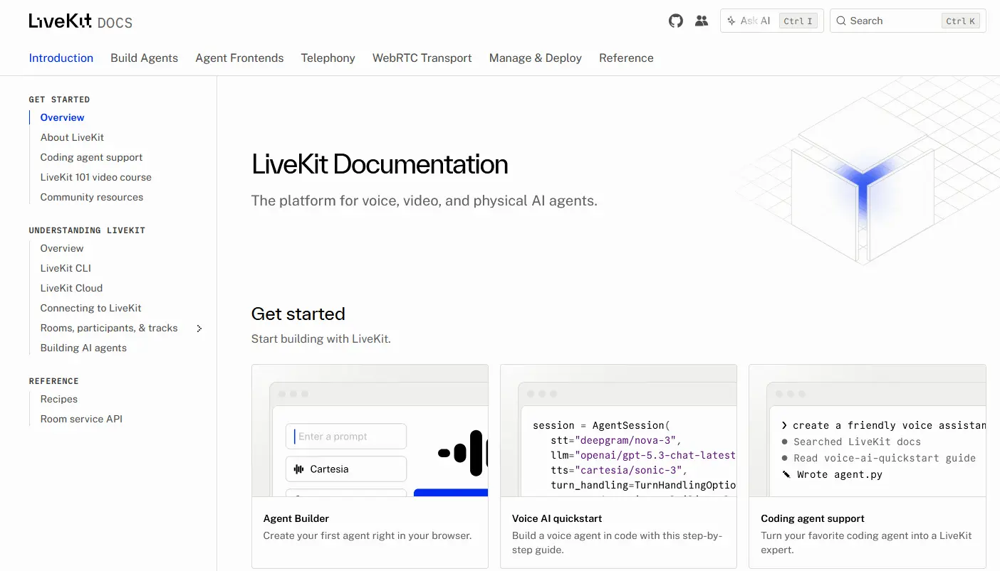
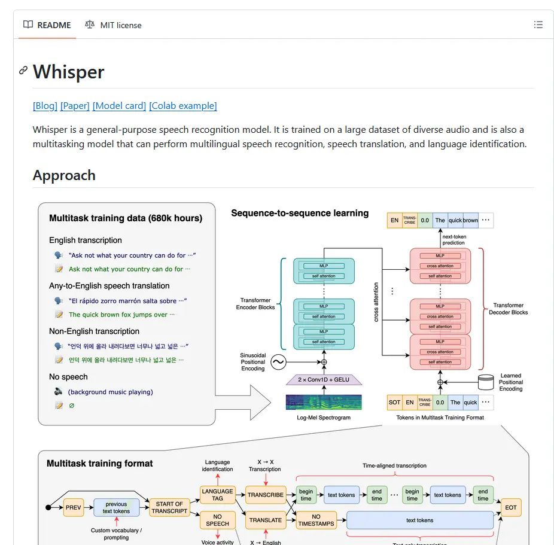
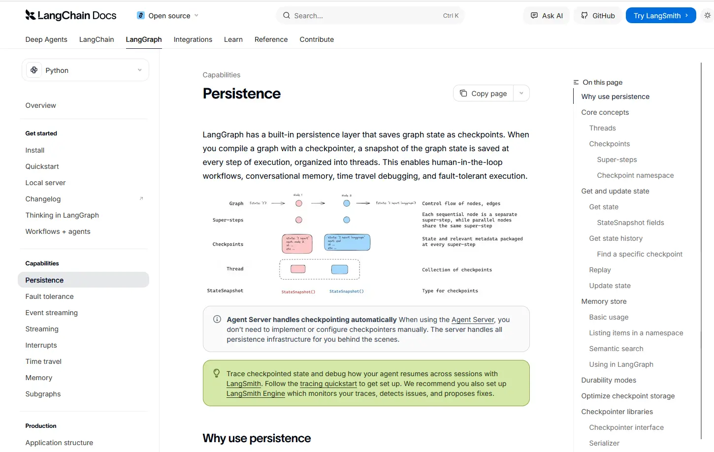
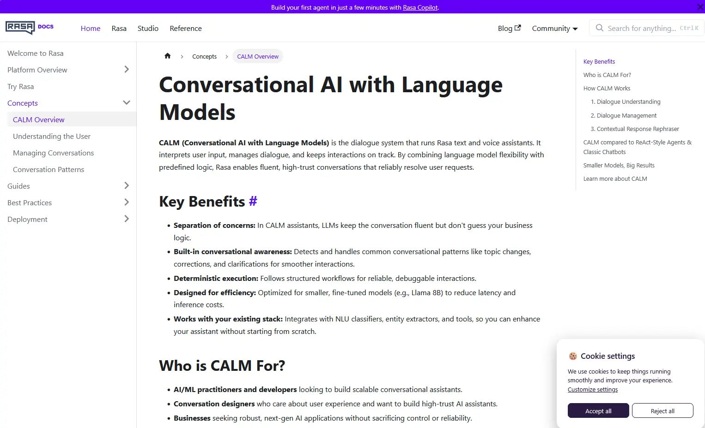
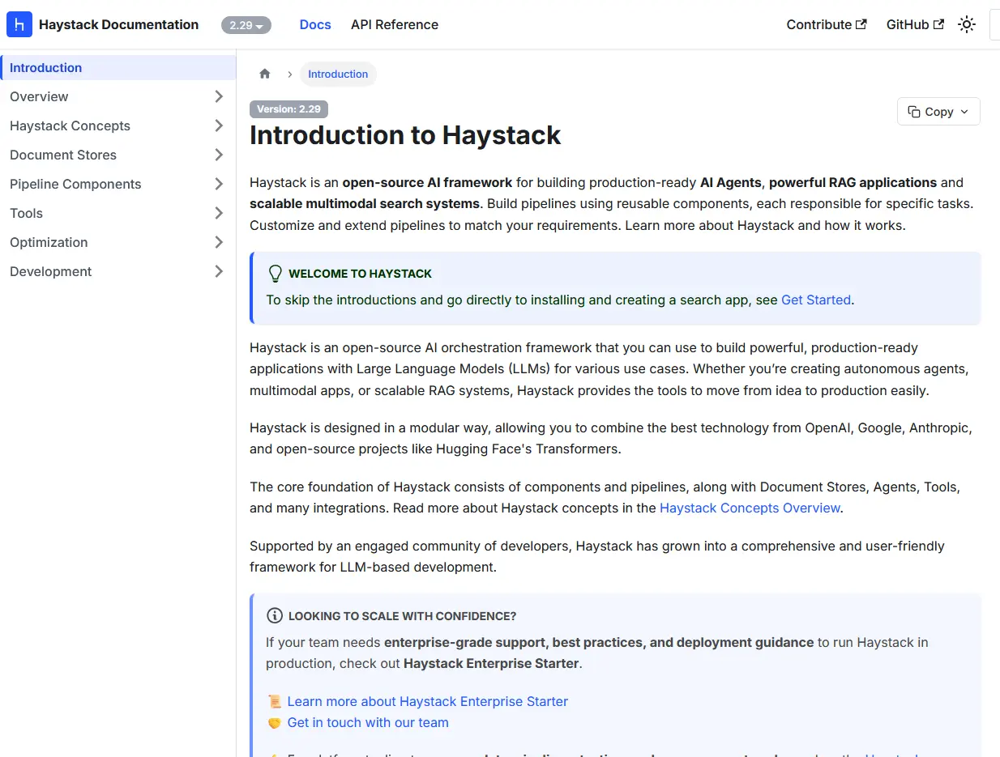
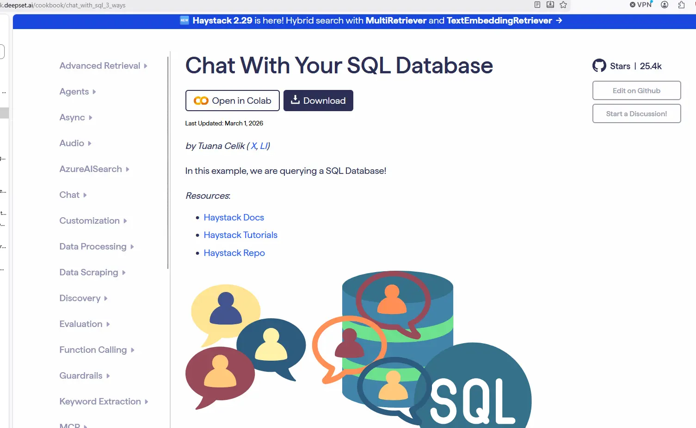
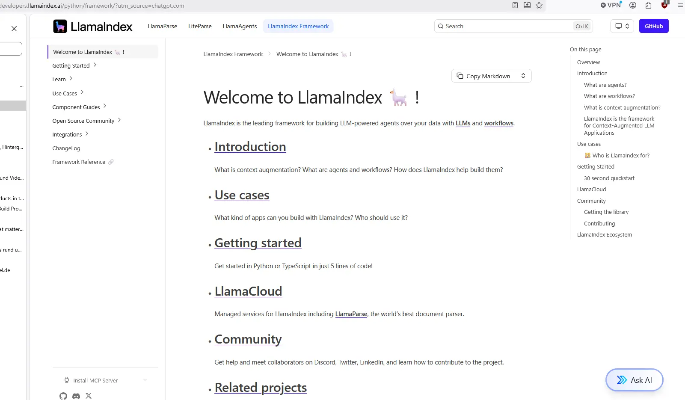

# https://langfuse.com/library#ai-engineering-library

# https://docs.livekit.io/agents/start/builder/

# https://github.com/openai/whisper

# https://docs.langchain.com/oss/python/langgraph/persistence

# https://rasa.com/docs/learn/concepts/calm/

# https://docs.haystack.deepset.ai/docs/intro

# https://haystack.deepset.ai/cookbook/chat_with_sql_3_ways

# https://developers.llamaindex.ai/python/framework/

