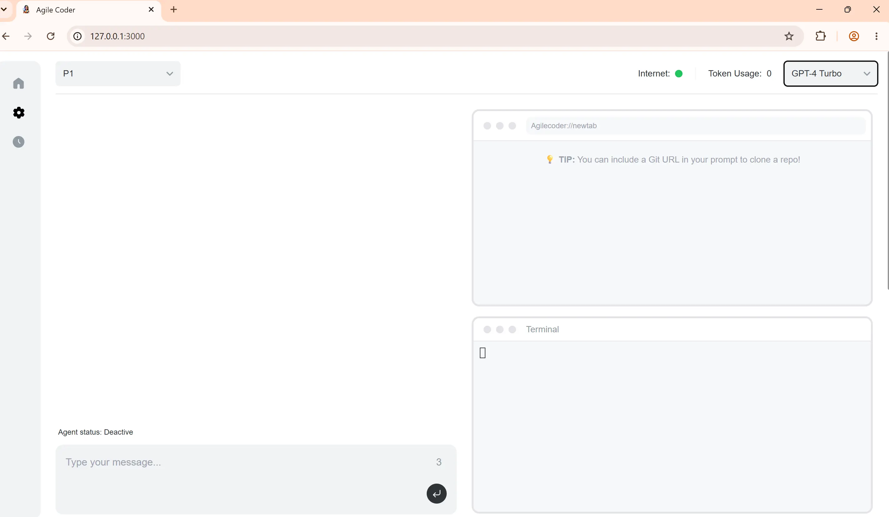
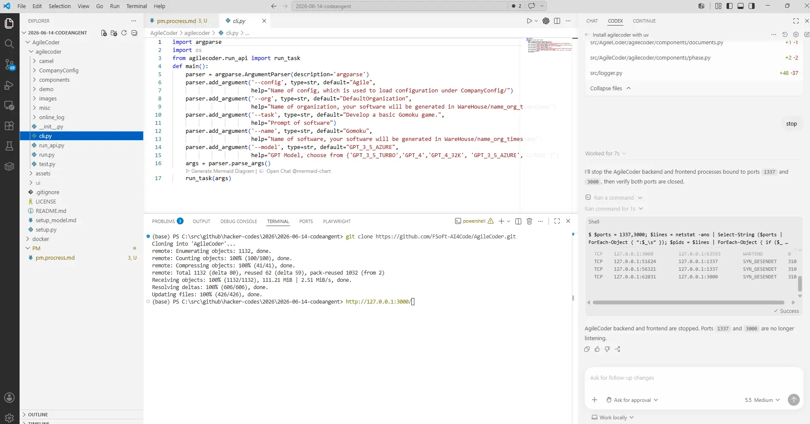
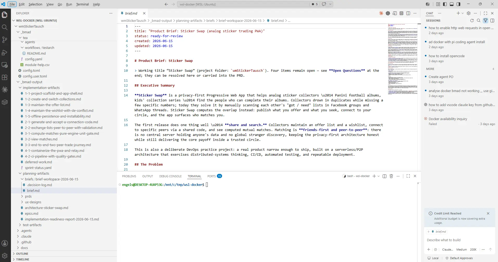
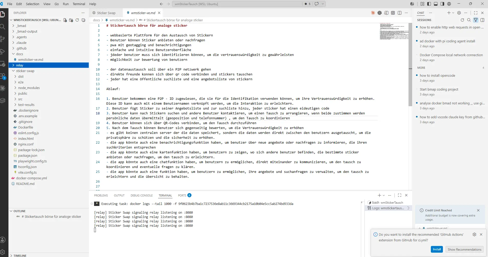
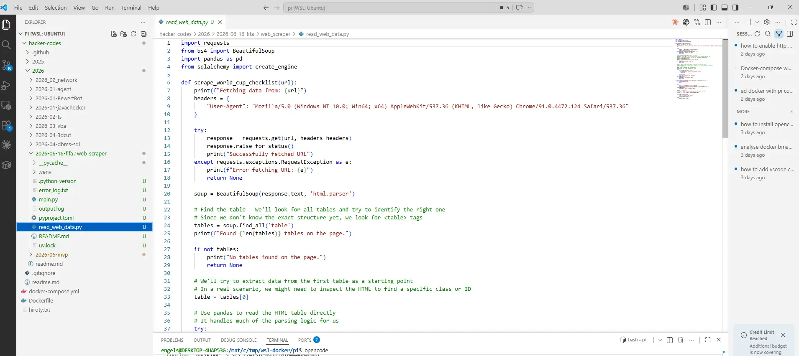
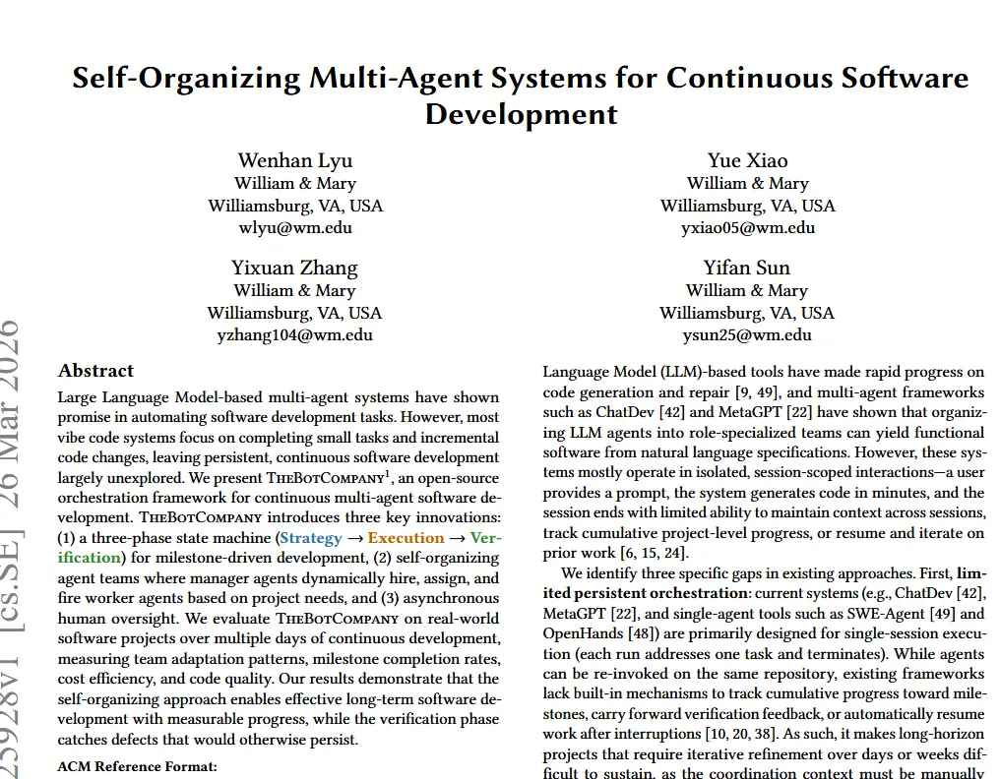
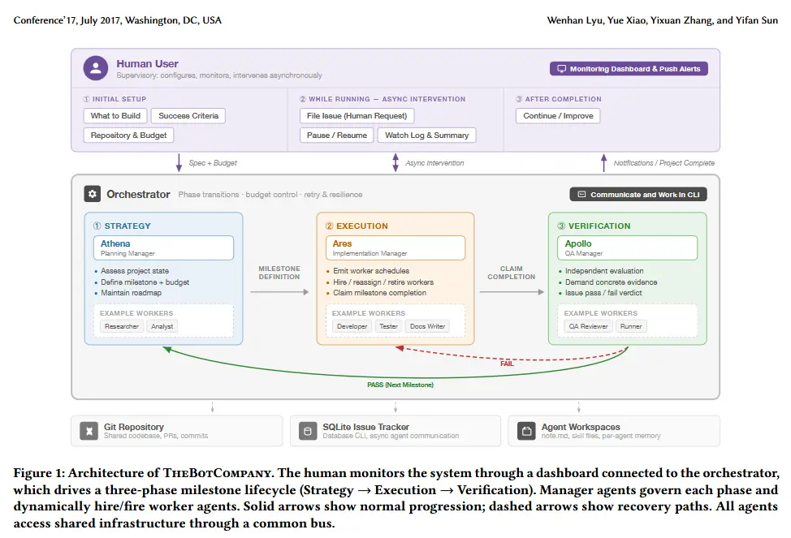
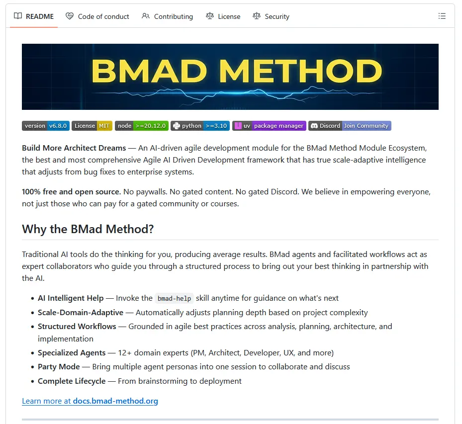
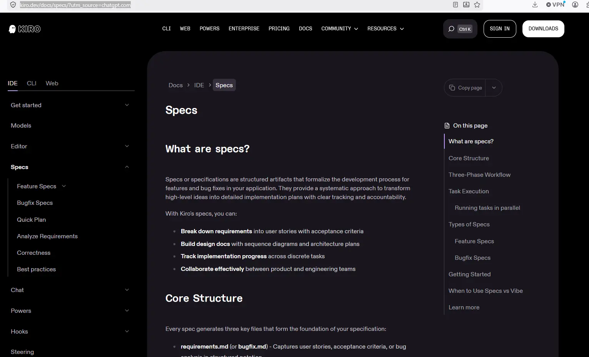

---
title:
tags:
date: 2026-06-15
toc: true
toc_sticky: true
---


# codingAgents


## AgileCoder





## Collection WSL Projects 







## TheBotCompany

https://arxiv.org/pdf/2603.25928 



## MetaGPT

## BMAD Method
https://github.com/bmad-code-org/bmad-method?utm_source=chatgpt.com


## Kiro 
https://kiro.dev/docs/specs/?utm_source=chatgpt.com


## Log

### Chat 1
I found **no current coding-agent product that natively and completely implements all four**:

1. Scrum roles and ceremonies
    
2. A distinct Product Owner agent
    
3. An explicit PDCA continuous-improvement cycle
    
4. CMM/CMMI process maturity and evidence management
    

Several systems cover substantial portions of this. “All coding agents” is not practically enumerable because new projects appear constantly, so this is a focused survey of the most relevant active frameworks and products as of June 2026.

## Best matches

|System|Scrum / sprints|Product Owner or PM|PDCA potential|CMM/CMMI potential|Overall fit|
|---|--:|--:|--:|--:|--:|
|**BMAD Method**|Strong|Strong|Strong through retrospectives and workflows|Medium; requires customization|**Best practical base**|
|**AgileCoder**|Strong|Product Manager|Medium|Low|**Best research prototype for Scrum**|
|**MetaGPT**|Partial|Product Manager|Medium|Medium through SOPs/artifacts|**Best programmable multi-agent base**|
|**ChatDev**|Weak|CPO/CEO-style roles|Medium|Low|Good virtual-company simulation|
|**Kiro**|Partial|Human acts as PO|Strong spec-review loop|Medium to strong evidence base|Best disciplined single-agent product|
|**Agentsway**|Agile-inspired|Planning roles|Strong learning loop|Medium|Promising research methodology|
|**TheBotCompany**|Milestones, not Scrum|Manager agents|Strong verification loop|Medium|Strong for continuous long-running work|
|**CrewAI / LangGraph**|Custom only|Custom only|Custom only|Custom only|Best for building your own system|
|**Jira/Confluence AI + coding agents**|Strong human Scrum support|Human PO assisted by AI|Strong with dashboards|Strongest organizational controls|Best enterprise composition|

## 1. BMAD Method

**BMAD is currently the closest overall match.**

It offers an AI-driven Agile development framework with specialized personas such as Product Manager, Architect, Developer, UX, Scrum Master, QA and Technical Writer. Its workflows span ideation, requirements, architecture, stories, implementation, testing and documentation. ([GitHub](https://github.com/bmad-code-org/bmad-method?utm_source=chatgpt.com "bmad-code-org/BMAD-METHOD: Breakthrough Method for ..."))

Why it fits:

- Dedicated Scrum Master and product-management personas
    
- Product briefs, PRDs, architecture and user-story workflows
    
- Sprint planning and story implementation
    
- QA and risk-based testing workflows
    
- Retrospectives and reusable process templates
    
- Structured artifacts that can become CMMI evidence
    

Limitations:

- It is an agent methodology layered onto tools such as Claude Code, Cursor or Codex, rather than a completely autonomous software company.
    
- Its public materials do not claim formal CMMI compliance.
    
- PDCA is structurally possible, but you must explicitly make sprint retrospectives, metrics and process updates part of the workflow.
    

**Verdict:** Start here when the objective is a usable Scrum-oriented system rather than a research experiment.

## 2. AgileCoder

AgileCoder is the most explicit Scrum-like multi-agent coding framework I found. It creates a backlog, divides development into sprints and dynamically updates the backlog. Its documented roles include Product Manager, Scrum Master, Developer, Senior Developer and Tester. ([fsoft-ai4code.github.io](https://fsoft-ai4code.github.io/agilecoder/?utm_source=chatgpt.com "AgileCoder: Dynamic Collaborative Agents for Software ..."))

Why it fits:

- Explicit sprint-based development
    
- Backlog management
    
- Product Manager agent
    
- Scrum Master agent
    
- Developers and testers
    
- Iterative code execution and verification
    
- Dynamic code-dependency graph
    

Limitations:

- It uses “Product Manager,” not necessarily a Scrum-accountable Product Owner.
    
- It is primarily a research framework.
    
- It does not provide a complete CMMI governance, measurement or appraisal layer.
    
- PDCA’s “Act” phase—changing and standardizing the development process—is not a major built-in feature.
    

**Verdict:** Best candidate for studying or extending an actual agentic Scrum team.

## 3. MetaGPT

MetaGPT models a software company using Product Manager, Architect, Project Manager, Engineer and QA-style roles. Its core idea is to encode standard operating procedures into a multi-agent workflow: “Code = SOP(Team).” It can generate requirements, user stories, architecture, APIs and implementation artifacts. ([GitHub](https://github.com/FoundationAgents/MetaGPT?utm_source=chatgpt.com "FoundationAgents/MetaGPT: 🌟 The Multi-Agent ..."))

Why it fits:

- Product-management role
    
- Explicit responsibilities and handoffs
    
- Standard operating procedures
    
- Persistent intermediate artifacts
    
- Programmable agent roles
    
- Better basis for process traceability than an unstructured coding agent
    

Limitations:

- It resembles a staged software-company lifecycle more than strict Scrum.
    
- No native Scrum Product Owner accountability.
    
- No formal PDCA controller.
    
- No native CMMI appraisal or process-area mapping.
    

**Verdict:** A strong engineering base when you intend to implement your own Scrum, PDCA and CMMI orchestration.

## 4. ChatDev

ChatDev simulates a virtual software company. Its roles include CEO, CTO, programmer, reviewer and tester; some variants add a CPO and designer. It covers design, coding, testing and documentation through structured multi-agent conversations. ([GitHub](https://github.com/OpenBMB/ChatDev?utm_source=chatgpt.com "ChatDev 2.0: Dev All through LLM-powered Multi-Agent ..."))

Why it fits:

- Product/leadership role can represent product ownership
    
- Review and testing loops
    
- Full development lifecycle
    
- Easy-to-understand organizational metaphor
    

Limitations:

- Not genuinely Scrum-oriented
    
- No native backlog, sprint goal or formal retrospective
    
- Weak process-measurement and maturity features
    
- Conversation logs alone are insufficient for CMMI evidence
    

**Verdict:** Useful for experimentation, but weaker than BMAD, AgileCoder and MetaGPT for disciplined process engineering.

## 5. Kiro

Kiro is not a virtual Scrum team, but its spec-driven workflow is relevant for quality and maturity. It structures work into requirements, design and tasks, with approval points and automated requirement analysis. It retains specification artifacts alongside implementation context. ([Kiro](https://kiro.dev/docs/specs/?utm_source=chatgpt.com "Specs - IDE - Docs"))

Why it fits:

- Requirements traceability
    
- Design before implementation
    
- Explicit task decomposition
    
- Human approval gates
    
- Unit tests and documentation
    
- Persistent specifications
    
- Good foundation for audit evidence
    

A possible PDCA mapping is:

- **Plan:** requirements, acceptance criteria, design and task plan
    
- **Do:** agent implements tasks
    
- **Check:** tests, requirement analysis and review
    
- **Act:** update specifications, rules and future tasks
    

Limitations:

- No separate Scrum Master or Product Owner agents
    
- Human users retain product ownership
    
- No formal CMMI interpretation or appraisal tooling
    

**Verdict:** Better for controlled, spec-led development than for role-playing a complete Scrum team.

## 6. Agentsway

Agentsway is a proposed software-development methodology specifically for AI-agent teams. It defines planning, prompting, coding, testing and fine-tuning roles, with retrospective learning and measurable productivity and trust metrics. ([arXiv](https://arxiv.org/abs/2510.23664?utm_source=chatgpt.com "Agentsway -- Software Development Methodology for AI Agents-based Teams"))

It is particularly interesting for PDCA:

- Planning agents establish objectives.
    
- Coding agents execute.
    
- Testing agents evaluate.
    
- Feedback and fine-tuning feed improvements into later cycles.
    

Limitations:

- Research methodology rather than a mature coding product
    
- Not specifically strict Scrum
    
- No demonstrated CMMI implementation
    

**Verdict:** Conceptually one of the closest to PDCA-based agent development, but not yet the most practical deployment choice.

## 7. TheBotCompany

TheBotCompany is a 2026 research framework for continuous multi-agent software development. It uses a three-phase state machine:

**Strategy → Execution → Verification**

Manager agents dynamically assign workers, and the verification phase catches problems before milestones are accepted. ([arXiv](https://arxiv.org/abs/2603.25928?utm_source=chatgpt.com "Self-Organizing Multi-Agent Systems for Continuous Software Development"))

This maps reasonably well to PDCA, though “Act” still needs an explicit process-improvement phase.

Limitations:

- Milestone-driven rather than Scrum
    
- No formal Product Owner role
    
- No CMMI mapping
    

**Verdict:** Relevant for long-running agent teams and continuous delivery, not the best out-of-the-box Scrum solution.

# What CMM/CMMI adds

CMMI is not merely a development workflow. It is an organizational process-improvement model organized into capability and practice areas. Its maturity levels provide a staged path from incomplete or ad hoc work toward managed, defined, quantitatively managed and optimizing processes. ([ISACA](https://www.isaca.org/resources/reference-guide/cmmi-model-quick-reference-guide?utm_source=chatgpt.com "CMMI Model Quick Reference Guide"))

Therefore, an agent platform needs more than PM, developer and tester roles to support CMMI. It also needs:

- Defined organizational processes
    
- Requirements and bidirectional traceability
    
- Configuration management
    
- Quality assurance independent from implementation
    
- Measurement and analysis
    
- Risk and supplier management where applicable
    
- Decision records
    
- Process compliance checks
    
- Corrective-action tracking
    
- Historical baselines and quantitative performance data
    
- Evidence that defined processes were actually followed
    

None of the reviewed systems supplies all of that as a native, appraisable CMMI solution.

## Recommended architecture

The strongest composition would be:

```text
Human Product Sponsor
        │
        ▼
Product Owner Agent
        │
        ├── Product vision
        ├── Product goal
        ├── Backlog ordering
        └── Acceptance decisions
        │
        ▼
Scrum Master / Process Agent
        │
        ├── Sprint planning
        ├── Impediment handling
        ├── Definition of Done
        └── Retrospective facilitation
        │
        ▼
Architecture + Development Agents
        │
        ├── Design
        ├── Implementation
        ├── Review
        └── Documentation
        │
        ▼
Independent QA / Verification Agent
        │
        ├── Acceptance testing
        ├── Security and quality gates
        ├── Traceability checks
        └── Evidence collection
        │
        ▼
Process Improvement Agent
        │
        ├── Metrics analysis
        ├── Root-cause analysis
        ├── Corrective actions
        └── Process-standard updates
```

## PDCA cycle for each sprint

PDCA is intended as a repeated improvement cycle rather than a one-time linear sequence. ([ASQ](https://asq.org/quality-resources/pdca-cycle?srsltid=AfmBOoraRCE0yM2hpfbMKhy2d4qtPvCXVNfF15Q_c2shHpAN0k0fFWUm&utm_source=chatgpt.com "PDCA Cycle - What is the Plan-Do-Check-Act Cycle?"))

### Plan

The Product Owner and Scrum Master agents produce:

- Product or sprint goal
    
- Ordered backlog
    
- Acceptance criteria
    
- Risks and assumptions
    
- Estimates
    
- Quality targets
    
- Test strategy
    
- Required evidence
    

### Do

Development agents:

- Implement selected stories
    
- Create tests and documentation
    
- Commit code using controlled branches
    
- Record decisions and deviations
    
- Link commits and tests to requirements
    

### Check

Independent agents:

- Run unit, integration, acceptance and security tests
    
- Compare results with sprint and quality objectives
    
- Inspect Definition of Done compliance
    
- Check requirements traceability
    
- Calculate defect, rework and cycle-time metrics
    

### Act

The process agent:

- Performs root-cause analysis
    
- Creates corrective and preventive actions
    
- Updates coding rules, prompts and workflow templates
    
- Adds process experiments to the next sprint
    
- Standardizes successful improvements
    
- Preserves approved evidence and baselines
    

## My ranking for your exact requirement

1. **BMAD Method plus a custom PDCA/CMMI governance agent**
    
2. **AgileCoder extended with metrics, evidence and process-improvement agents**
    
3. **MetaGPT with custom Scrum roles and CMMI SOPs**
    
4. **Kiro plus Jira/Confluence and an external process-governance layer**
    
5. **CrewAI or LangGraph implementing the entire organization yourself**
    
6. **Agentsway or TheBotCompany for research and experimentation**
    
7. **ChatDev for virtual-team prototyping**
    

The most realistic solution is **not one coding agent**. It is an orchestrated system consisting of BMAD or MetaGPT, a coding harness such as Pi/OpenCode/Claude Code, a backlog system, CI/CD quality gates, an evidence store and a dedicated process-improvement agent.

