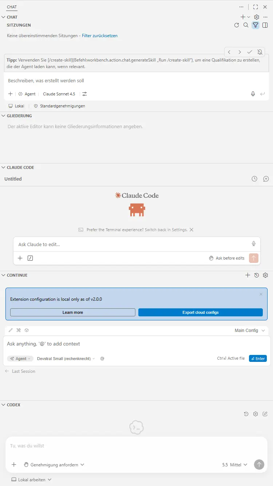
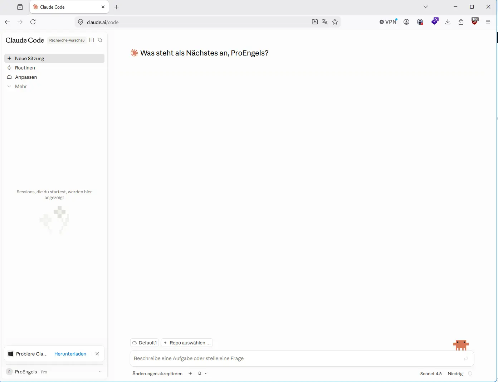
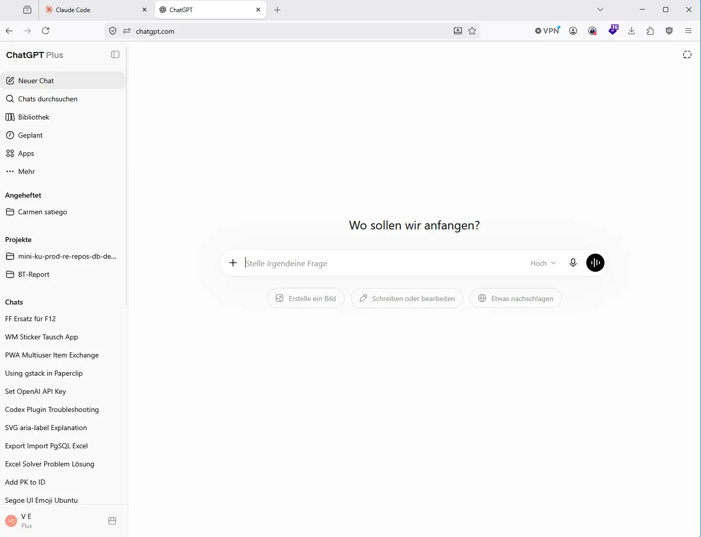
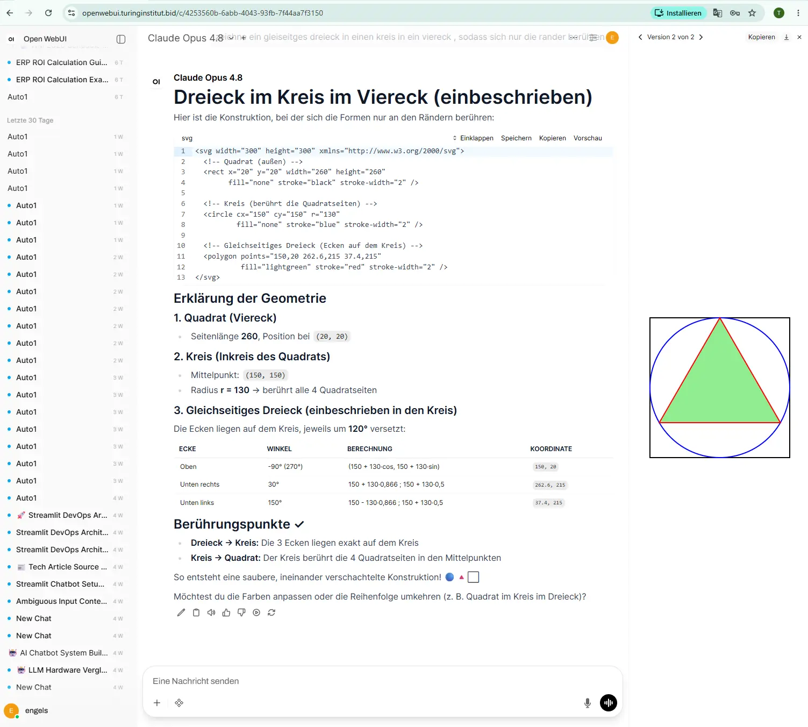
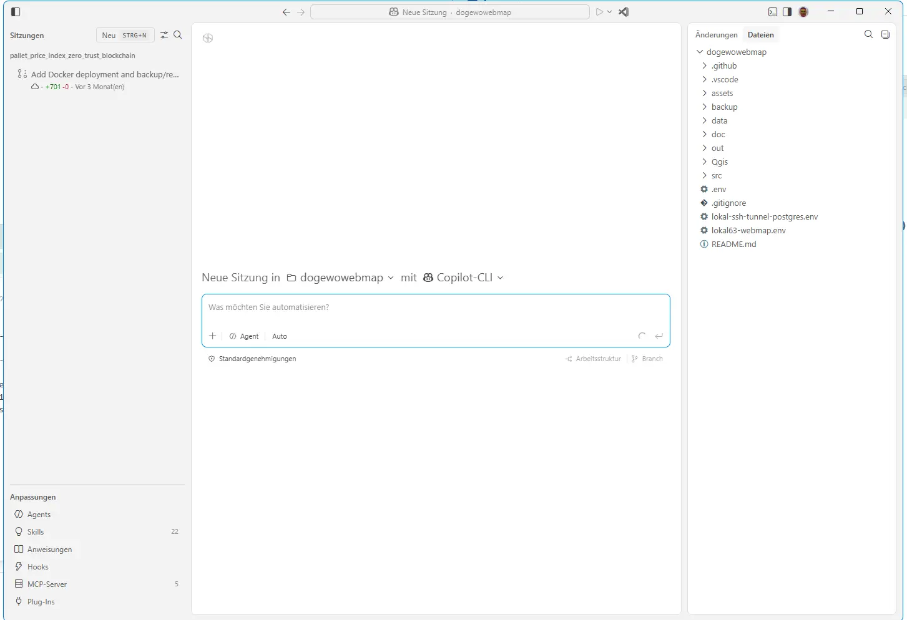
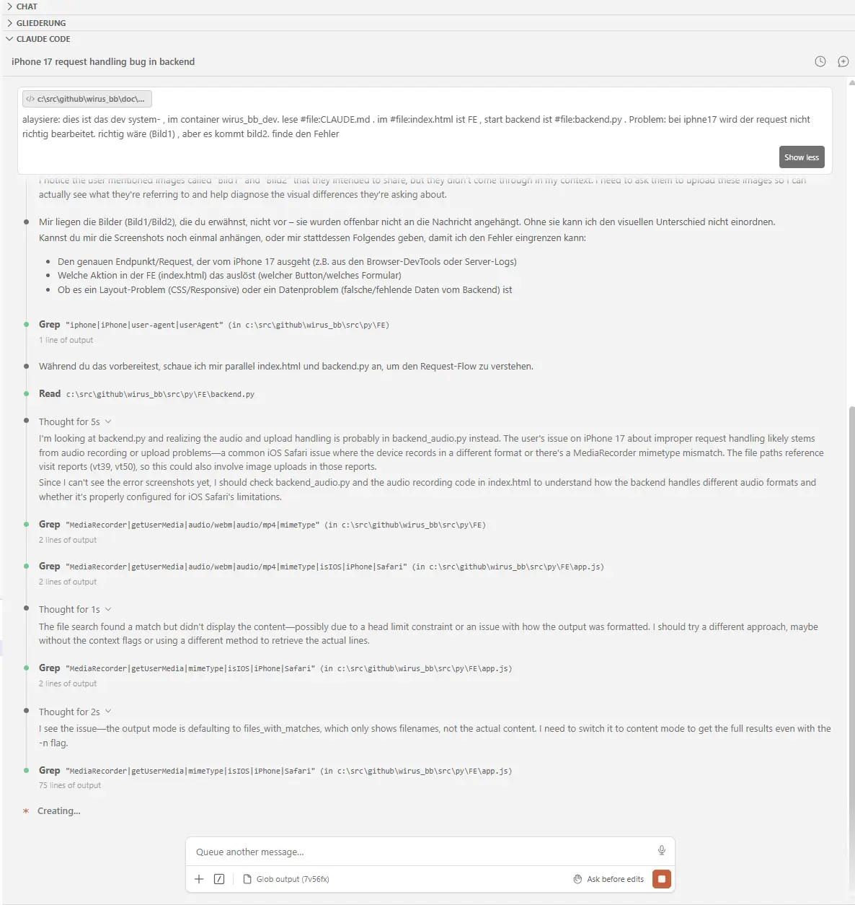

# All VS Code Agents

##


## Agent Migration to Claude 

```


Export all of my stored memories and any context you've learned about me from past conversations. Preserve my words verbatim where possible, especially for instructions and preferences.

## Categories (output in this order):

1. **Instructions**: Rules I've explicitly asked you to follow going forward — tone, format, style, "always do X", "never do Y", and corrections to your behavior. Only include rules from stored memories, not from conversations.

2. **Identity**: Name, age, location, education, family, relationships, languages, and personal interests.

3. **Career**: Current and past roles, companies, and general skill areas.

4. **Projects**: Projects I meaningfully built or committed to. Ideally ONE entry per project. Include what it does, current status, and any key decisions. Use the project name or a short descriptor as the first words of the entry.

5. **Preferences**: Opinions, tastes, and working-style preferences that apply broadly.

## Format:

Use section headers for each category. Within each category, list one entry per line, sorted by oldest date first. Format each line as:

[YYYY-MM-DD] - Entry content here.

If no date is known, use [unknown] instead.

## Output:
- Wrap the entire export in a single code block for easy copying.
- After the code block, state whether this is the complete set or if more remain.
```


## 


## 



## openai + claude api 



## vscode agentenfenster 



## cc in action 

