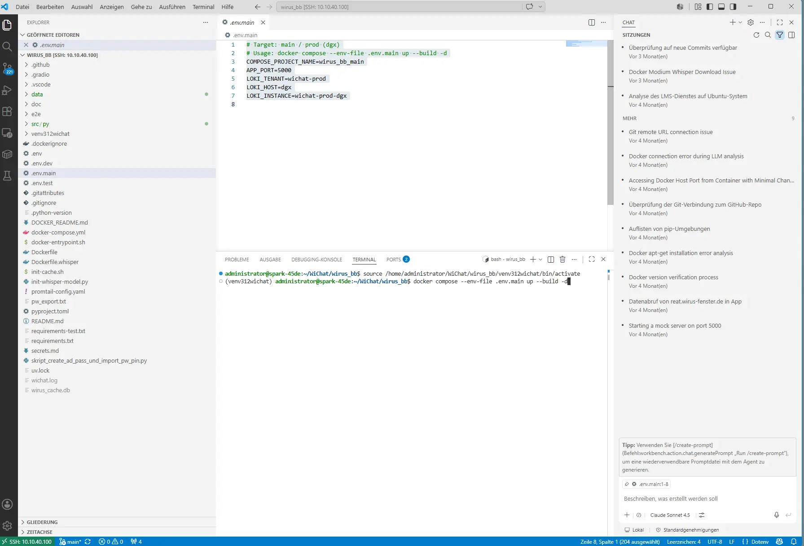
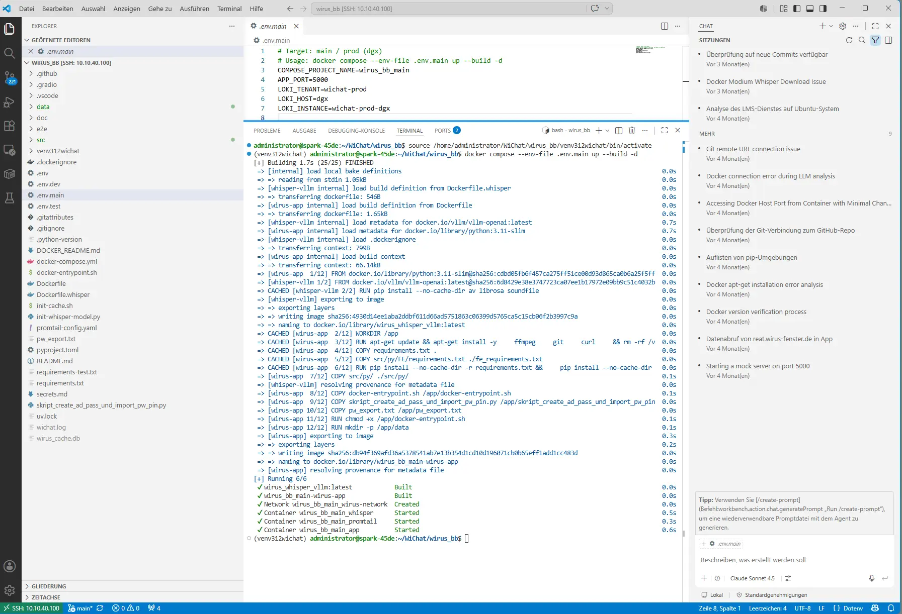
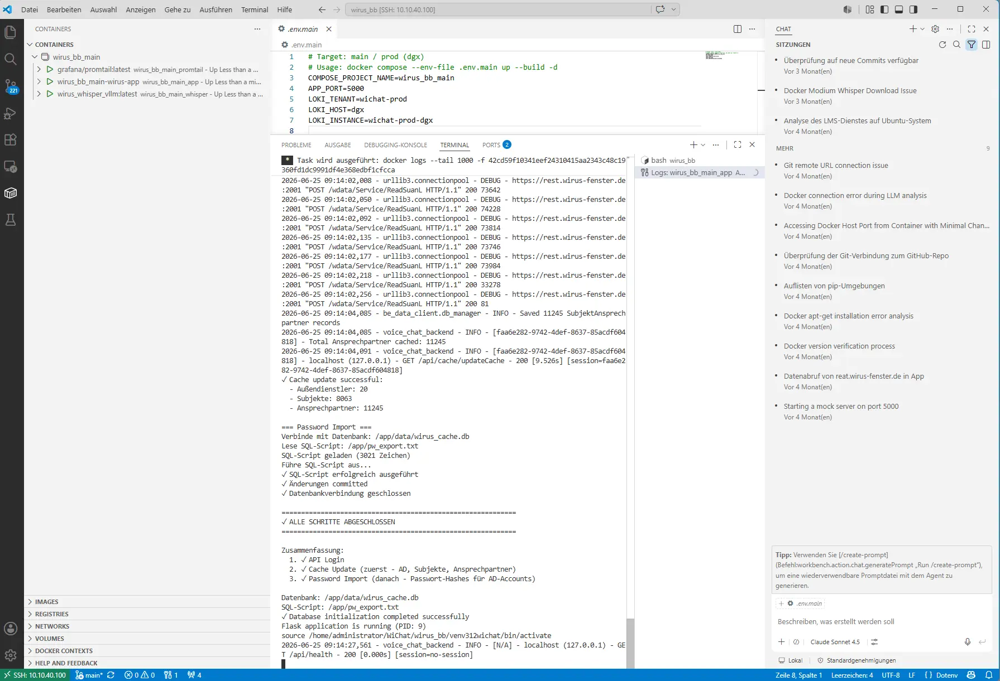
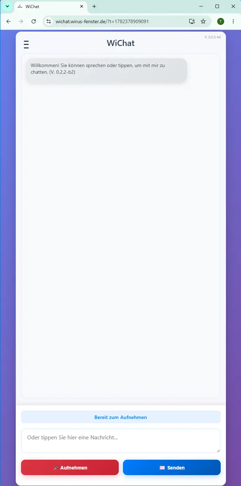
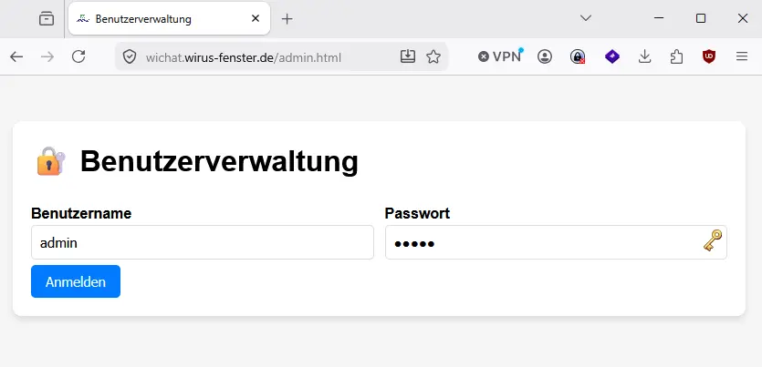
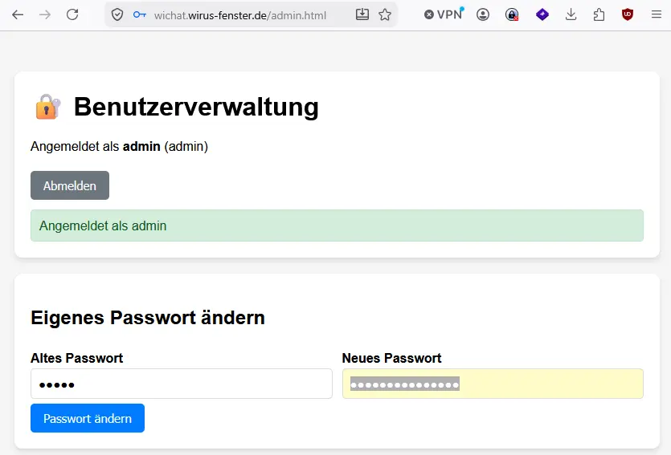
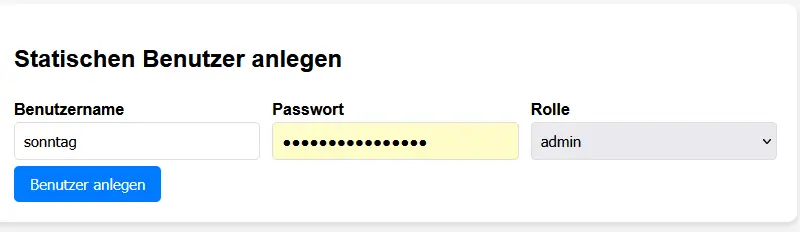
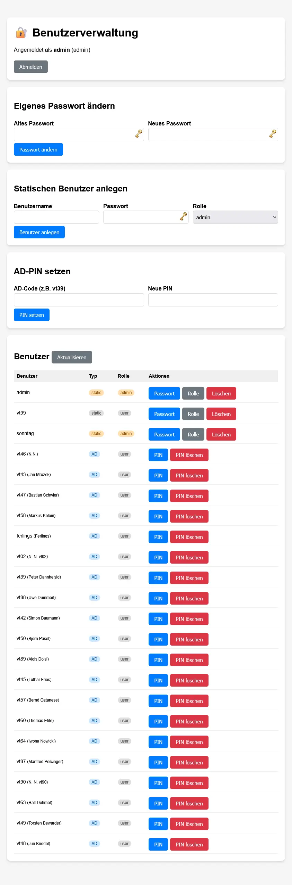

# 

## Screen 









## promtail-config.yaml
```
server:

  http_listen_port: 9080

  grpc_listen_port: 0

  

positions:

  filename: /tmp/positions.yaml

  

clients:

  - url: https://loki.softwareengel.org/loki/api/v1/push

    tenant_id: ${LOKI_TENANT}

    external_labels:

      host: ${LOKI_HOST}

      instance: ${LOKI_INSTANCE}

scrape_configs:

  - job_name: docker

    docker_sd_configs:

      - host: unix:///var/run/docker.sock

        refresh_interval: 5s

    relabel_configs:

      - source_labels: [__meta_docker_container_name]

        regex: /(.*)

        target_label: container

      - source_labels: [__meta_docker_container_log_stream]

        target_label: stream

      - source_labels: [__meta_docker_container_label_com_docker_compose_service]

        target_label: service
```
## docker.compose 
```
name: ${COMPOSE_PROJECT_NAME:-wirus_bb_dev}

  

services:

  wirus-app:

    build:

      context: .

      dockerfile: Dockerfile

      network: host

    container_name: ${COMPOSE_PROJECT_NAME:-wirus_bb_dev}_app

    ports:

      - "${APP_PORT:-5000}:5000" # Dev 5005, Test 5006, Prod 5000 (set via APP_PORT)

    environment:

      - FLASK_APP=src/py/FE/backend.py

      - FLASK_ENV=production

      - FLASK_DEBUG=false

      - FLASK_RUN_HOST=0.0.0.0

      - FLASK_RUN_PORT=5000

      - WHISPER_MODEL_SIZE=${WHISPER_MODEL_SIZE:-medium}

      # vLLM Whisper Service (OpenAI-kompatibel) - Transkription laeuft im GPU-Container

      - WHISPER_API_BASE=${WHISPER_API_BASE:-http://whisper-vllm:8000/v1}

      - WHISPER_VLLM_MODEL=${WHISPER_VLLM_MODEL:-openai/whisper-medium}

      # Add your environment variables here or use env_file

    depends_on:

      - whisper-vllm

    env_file:

      - .env  # Optional: create this file for local environment variables

    volumes:

      # Mount data directories for persistence

      - ./data:/app/data  # Main data directory (includes wirus_cache.db)

      - ./src/py/FE/data:/app/src/py/FE/data

      - ./src/py/FE/records:/app/src/py/FE/records

      - ./src/py/FE/feedback:/app/src/py/FE/feedback

      - ./src/py/FE/config.yaml:/app/src/py/FE/config.yaml  # Config-Datei für E-Mail-Einstellungen

    restart: unless-stopped

    networks:

      - wirus-network

    logging:

      driver: json-file

      options:

        max-size: "10m"

        max-file: "3"

  

  whisper-vllm:

    # Eigenes Image: vllm/vllm-openai + Audio-Dekodier-Abhaengigkeiten (PyAV/librosa/soundfile).

    # Das Stock-Image bringt diese nicht mit -> sonst "Invalid or unsupported audio file".

    build:

      context: .

      dockerfile: Dockerfile.whisper

    image: wirus_whisper_vllm:latest

    container_name: ${COMPOSE_PROJECT_NAME:-wirus_bb_dev}_whisper

    # vLLM serviert das Whisper-Modell ueber einen OpenAI-kompatiblen Endpoint

    # /v1/audio/transcriptions auf Port 8000 (nur im internen Netz erreichbar).

    command:

      - "--model"

      - "${WHISPER_VLLM_MODEL:-openai/whisper-medium}"

      # Whisper-medium ist klein; VRAM-Auslastung begrenzen, damit der Start auf

      # GPUs mit ~16 GB (z.B. RTX 5070 Ti) nicht an der 0.9-Default-Reservierung scheitert.

      - "--gpu-memory-utilization"

      - "${WHISPER_GPU_MEM_UTIL:-0.5}"

    environment:

      # HuggingFace-Token optional, falls private Modelle genutzt werden

      - HUGGING_FACE_HUB_TOKEN=${HUGGING_FACE_HUB_TOKEN:-}

    volumes:

      # HF-Modell-Cache persistieren, damit das Modell nicht bei jedem Start neu geladen wird

      - whisper-hf-cache:/root/.cache/huggingface

    # GPU-Zugriff (benoetigt nvidia-container-toolkit auf dem Host)

    deploy:

      resources:

        reservations:

          devices:

            - driver: nvidia

              count: all

              capabilities: [gpu]

    restart: unless-stopped

    networks:

      - wirus-network

    logging:

      driver: json-file

      options:

        max-size: "10m"

        max-file: "3"

  

  promtail:

    image: grafana/promtail:latest

    container_name: ${COMPOSE_PROJECT_NAME:-wirus_bb_dev}_promtail

    environment:

      # Loki-Labels werden zur Laufzeit aus dem env-file in die Config expandiert

      - LOKI_TENANT=${LOKI_TENANT}

      - LOKI_HOST=${LOKI_HOST}

      - LOKI_INSTANCE=${LOKI_INSTANCE}

    volumes:

      - ./promtail-config.yaml:/etc/promtail/config.yaml:ro

      - /var/run/docker.sock:/var/run/docker.sock

    command: -config.file=/etc/promtail/config.yaml -config.expand-env=true

    restart: unless-stopped

    networks:

      - wirus-network

  

networks:

  wirus-network:

    driver: bridge

  

volumes:

  whisper-hf-cache:
```

## .env.main

``` 
# Target: main / prod (dgx)

# Usage: docker compose --env-file .env.main up --build -d

COMPOSE_PROJECT_NAME=wirus_bb_main

APP_PORT=5000

LOKI_TENANT=wichat-prod

LOKI_HOST=dgx

LOKI_INSTANCE=wichat-prod-dgx

```
## config.yaml 
``` yaml 
### DEV Config

  

# Whisper Konfiguration

whisper:

  model_size: medium  # tiny, base, small, medium, large

  # device: cpu  # cpu oder cuda

  # language: de  # Standardsprache für Transkription

  

# OpenAI Konfiguration

# openai:

#   model: gpt-4  # oder gpt-3.5-turbo

#   temperature: 0.7

#   max_tokens: 2000

  

# lokale LLMs Konfiguration

  

local_llm:

#         temperature=  ChatAgentParams.ChatAgentParams_DEFAULTS.get("temperature", 0.1),

# max_tokens=ChatAgentParams.ChatAgentParams_DEFAULTS.get("max_tokens", 2048),

# streaming=ChatAgentParams.ChatAgentParams_DEFAULTS.get("streaming", False),

# llm_type="lm_studio",

# model_name="openai/gpt-oss-20b",

  llm_type: lm_studio  # lm_studio, local_gpt

  model_name: openai/gpt-oss-20b

  # base_url: http://rechenknecht:1234

  # base_url: http://10.10.10.28:1234

  

  base_url: http://10.10.40.100:1234  # Host-IP (LM Studio muss auf 0.0.0.0:1234 lauschen!)

  # base_url: http://127.0.0.1:1234  # Nur für lokale Tests außerhalb Docker

  

  temperature: 0.1

  max_tokens: 2024

  streaming: false

  

# Logging Konfiguration

logging:

  level: DEBUG  # DEBUG, INFO, WARNING, ERROR, CRITICAL

  file: wichat.log

#   max_bytes: 10485760  # 10MB

#   backup_count: 5

  

# Flask/Backend Konfiguration

# backend:

#   host: 127.0.0.1

#   port: 5000

#   debug: true

#   secret_key_env: SECRET_KEY  # Name der Umgebungsvariable

  

# # Session Konfiguration

# session:

#   cookie_httponly: true

#   cookie_samesite: Lax

#   permanent_lifetime: 86400  # 24 Stunden in Sekunden

  

# # CORS Konfiguration

# cors:

#   origins:

#     - http://localhost:*

#     - http://127.0.0.1:*

#   supports_credentials: true

  

# Entwicklungsmodus

development:

  use_vt_as_hash_passwords: false

  test_mode: false  # Wenn true: Email nur an Test-Adressen, keine CC an echte AD-User

  use_cc_emails_in_test_mode: false  

  

email:

  smtp_host: smtp.tal.de # smtp.gmail.com

  smtp_port: 465

  smtp_user: wichat@turinginstitut.de

  smtp_password: 'RsOGmnhCjHe{coDP995I'

  from_email: wichat@turinginstitut.de

  from_name: WiChat Besuchsbericht-System

  # use_tls: true

  # Email für Backoffice Benachrichtigungen

  # to_email: A.Wien@wirus-fenster.de # A.Wien@wirus-fenster.de

  to_email: wichat@turinginstitut.de # A.Wien@wirus-fenster.de

  cc_email: besuchsberichte@wirus-fenster.de #  Gruppen - Email  + AD , bei Testmode nur Gruppen - Email

  bcc_email: wichat@turinginstitut.de

  

  # 'smtp_host': os.getenv('SMTP_HOST', 'smtp.gmail.com'),

  # 'smtp_port': int(os.getenv('SMTP_PORT', '587')),

  # 'smtp_user': os.getenv('SMTP_USER', ''),

  # 'smtp_password': os.getenv('SMTP_PASSWORD', ''),

  # 'from_email': os.getenv('FROM_EMAIL', 'noreply@wirus-fenster.de'),

  # 'from_name': os.getenv('FROM_NAME', 'WiChat Besuchsbericht-System')

  

# Datei-Upload Konfiguration

# upload:

#   max_file_size: 16777216  # 16MB in Bytes

#   allowed_extensions:

#     - wav

#     - mp3

#     - m4a

#     - ogg

#   temp_folder: temp_uploads

  

app_version:

  major: 0

  minor: 2

  patch: 2

  tag: 'b'  # alpha, beta, rc, stable

  revision: 2
```


## admin 



Y7J8hs%j5$k9;z?



Y7J8hs%j5$k9;z?3




