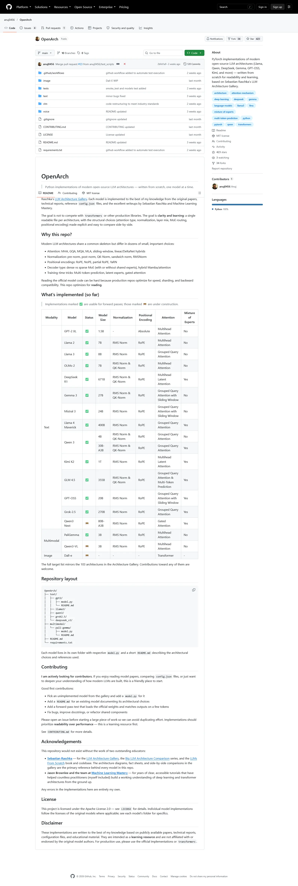

# OpenArch

> Python implementations of modern open-source LLM architectures — written from scratch, one model at a time.

This repository contains hand-written PyTorch implementations of the model architectures cataloged in Sebastian Raschka's [LLM Architecture Gallery](https://sebastianraschka.com/llm-architecture-gallery/). Each model is implemented to the best of my knowledge from the original papers, technical reports, reference `config.json` files, and the excellent writeups by Sebastian Raschka and Machine Learning Mastery.

The goal is not to compete with `transformers` or other production libraries. The goal is **clarity and learning**: a single readable file per architecture, with the structural choices (attention type, normalization, layer mix, MoE routing, positional encoding) made explicit and easy to compare side-by-side.

## Links 

https://github.com/anuj0456/OpenArch