# codingagents-diy CC

Beispiel : https://softwareengel.github.io/hacker-codes/web-java-ide/

## plan GPT

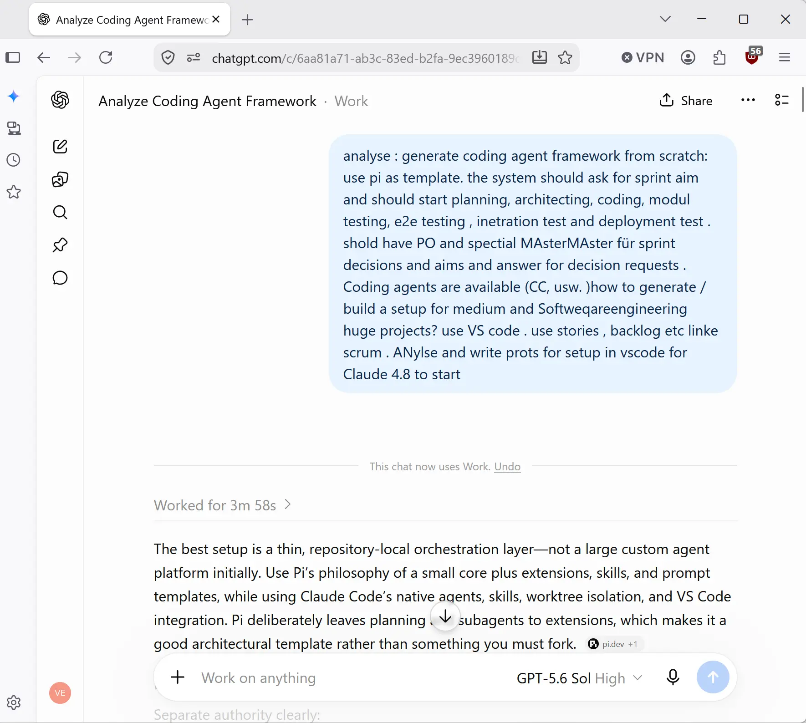


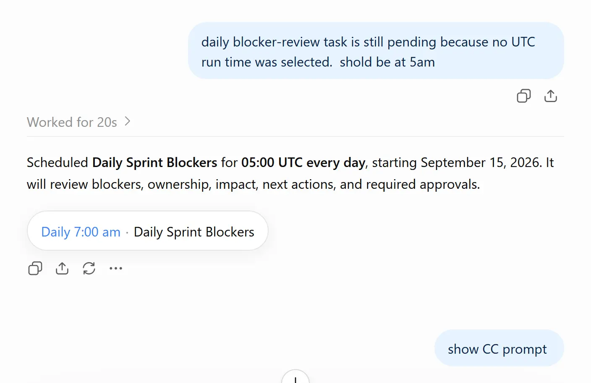

### prompt


```text
You are the Sprint Orchestrator and Framework Builder for a medium-to-large
software-engineering project.

Use Claude Opus 4.8. Build a repository-local, VS Code-oriented multi-agent
delivery framework inspired by Pi: minimal core, explicit state, reusable
skills, prompt templates and isolated coding agents.

Do not overwrite unrelated changes. Do not deploy to production.

FIRST ACTION

Inspect `.delivery/current-sprint.yaml`.

If there is no active, human-confirmed sprint aim, stop and ask:

"What is the sprint aim? Please provide:
1. Target user
2. Measurable outcome
3. Deadline
4. Important non-goals
5. Technical or business constraints"

Do not plan, architect or code until the sprint aim is confirmed.

AGENT ROLES

Create or update these project agents under `.claude/agents/`:

- sprint-orchestrator
- product-owner
- decision-master
- architect
- coder
- module-tester
- integration-tester
- e2e-tester
- deployment-tester
- code-reviewer

Responsibilities:

Product Owner:
- Refine stories, value, scope, priority and acceptance criteria.
- Escalate invented or missing business requirements to the human Product Owner.

Decision Master:
- Answer structured technical decision requests.
- Record decisions and rationale in `.delivery/decisions/`.
- May decide reversible technical matters.
- Must escalate sprint-aim changes, security, compliance, destructive migrations,
  significant costs and production releases to a human.

Architect:
- Produce architecture changes, interface contracts, ADRs, dependencies,
  migration plans, observability requirements and rollback strategies.

Coder:
- Implement exactly one ready story.
- Work in an isolated git worktree.
- Never weaken tests or acceptance criteria.
- Stop and create a decision request when requirements are ambiguous.

Test agents:
- Do not modify production code.
- Produce reproducible evidence.
- Module tester verifies components in isolation.
- Integration tester verifies service, database and contract boundaries.
- E2E tester verifies user journeys and important failure paths.
- Deployment tester verifies staging deployment, configuration, smoke tests,
  monitoring and rollback. It must not deploy to production.

Code Reviewer:
- Review correctness, security, maintainability, architecture and test coverage.
- Report findings with severity and exact evidence.

SCRUM ARTIFACTS

Create or update:

- `AGENTS.md`
- `CLAUDE.md`, importing `@AGENTS.md`
- `.delivery/product-vision.md`
- `.delivery/backlog.yaml`
- `.delivery/current-sprint.yaml`
- `.delivery/decisions/`
- `.delivery/architecture/`
- `.delivery/evidence/`
- `.agent-framework/decision-policy.md`
- `.agent-framework/quality-gates.md`
- `.agent-framework/handoff-schema.md`
- `.agent-framework/workflows/sprint-lifecycle.md`

Each story must contain:

- ID
- User/persona
- Desired behavior
- Business value
- Given/When/Then acceptance criteria
- Dependencies
- Risks
- Test requirements
- Owner
- Status
- Evidence links

WORKFLOW

Enforce this lifecycle:

Sprint aim confirmed
→ Product Owner refinement
→ Definition of Ready
→ Architecture review
→ Story and dependency planning
→ Implementation in isolated worktree
→ Module tests
→ Independent code review
→ Integration tests
→ E2E tests
→ Staging deployment test
→ Human production approval
→ Sprint review and closeout

Do not skip a failed gate.

DEFINITION OF READY

A story is Ready only when:

- It contributes directly to the sprint aim.
- Acceptance criteria are measurable.
- Dependencies and affected components are identified.
- Architecture impact is understood.
- Test and rollback requirements exist.
- Required decisions are resolved.

DEFINITION OF DONE

A story is Done only when:

- Acceptance criteria are demonstrated.
- Build, lint and type checks pass.
- Required module, integration and E2E tests pass.
- Code review has no unresolved critical findings.
- Deployment smoke test succeeds in staging.
- Rollback procedure is documented or tested.
- Evidence is saved under `.delivery/evidence/`.
- Documentation and ADRs are updated.

HANDOFF CONTRACT

Every agent result must contain:

- status
- story_id
- objective
- assumptions
- decisions and rationale
- alternatives considered
- changed_files
- commands_run
- test_evidence
- risks
- unresolved_questions
- decision_requests
- recommended_next_gate

CHATLOG

Automatically log every completed subagent and the main session.

Create:

- `.claude/hooks/export-chatlog.mjs`
- `docs/chatlog/`
- required hook configuration in `.claude/settings.json`

Register:

- `SubagentStop` using `agent_transcript_path`
- `SessionEnd` using `transcript_path`

Output file:

`docs/chatlog/YYYY-MM-DD-TOPIC.md`

Read TOPIC from `chatlog_topic` in `.delivery/current-sprint.yaml`.
Otherwise derive it from the current story. Sanitize it as lowercase kebab-case.

Append one section per agent:

## Agent: <agent-type>

- Date:
- Session ID:
- Agent ID:
- Story:
- Status:
- Branch/worktree:

### Objective
### Assumptions
### Decisions and rationale
### Alternatives considered
### Visible conversation
### Tool calls and relevant results
### Files changed
### Tests and evidence
### Risks and unresolved questions
### Final response

Use this idempotency marker:

`<!-- chatlog-event:<session-id>:<agent-id> -->`

Logging requirements:

- Convert Claude JSONL into readable Markdown.
- Preserve visible messages, tool calls, results, errors and decision rationale.
- Do not claim to capture hidden chain-of-thought.
- Exclude `thinking` and `redacted_thinking` blocks.
- Redact API keys, tokens, passwords, cookies, authorization headers and `.env`
  values.
- Truncate large or binary outputs while recording their source, size and hash.
- Use atomic append and a cross-platform lock.
- Prevent duplicate entries.
- Add automated tests for redaction, concurrency, malformed JSONL, filename
  sanitization and idempotency.
- Record failures under `.delivery/logging-errors/`.

VS CODE

Create `.vscode/tasks.json` with tasks for:

- Agents: Start sprint
- Test: Module
- Test: Integration
- Test: E2E
- Test: Deployment
- Sprint: Review blockers
- Sprint: Close

The start task should run:

`claude --agent sprint-orchestrator --model claude-opus-4-8`

VALIDATION

After creating the framework:

1. Validate JSON, YAML and agent frontmatter.
2. Confirm referenced build and test commands exist.
3. Test the chatlog exporter with fixture transcripts.
4. Run only safe local checks.
5. Do not push, merge or deploy.
6. Report:
   - Files created or changed
   - Validation commands and results
   - Assumptions
   - Unresolved decisions
   - Exact VS Code command for starting the first sprint


```


## CC

### Projekt DESC

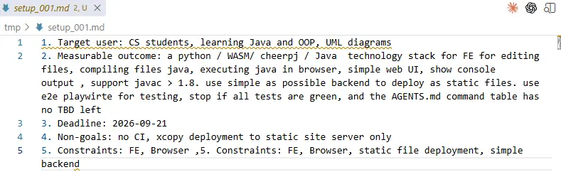


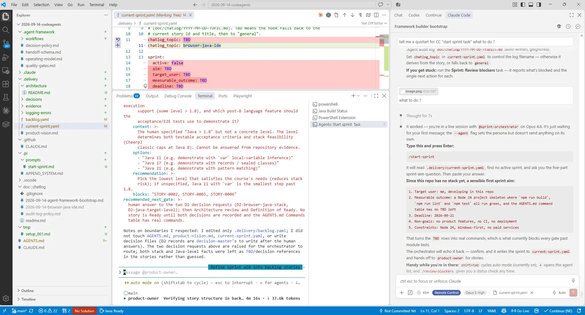

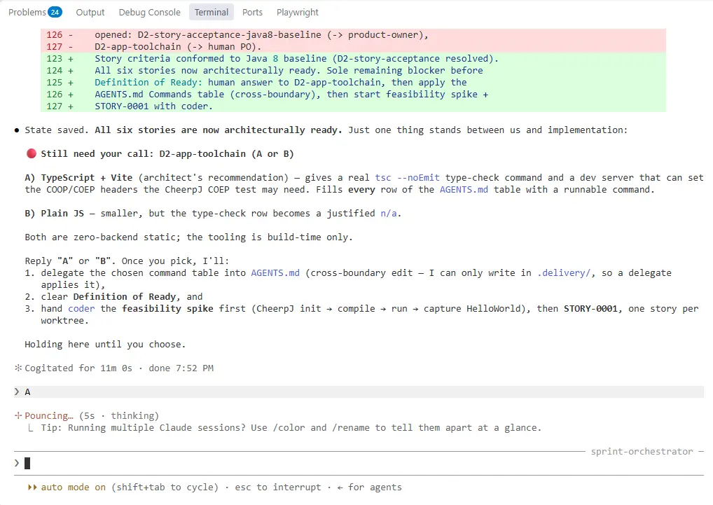

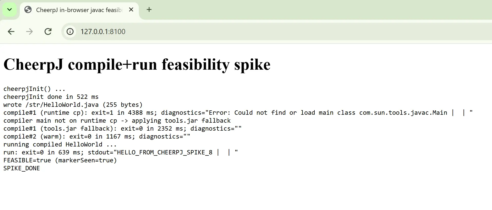
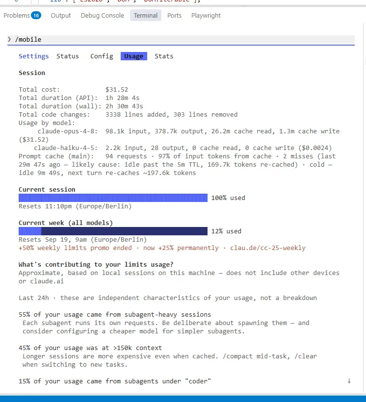
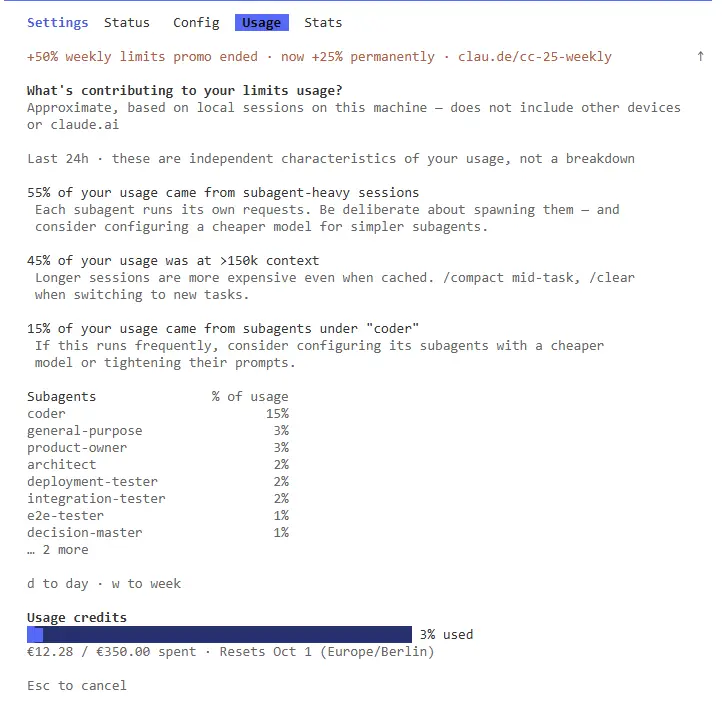

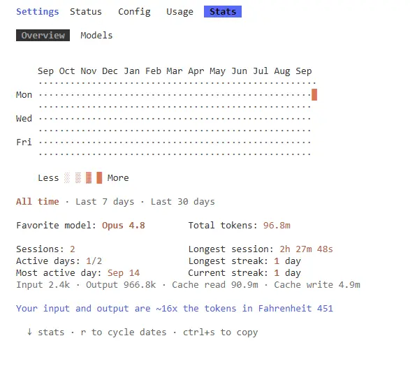
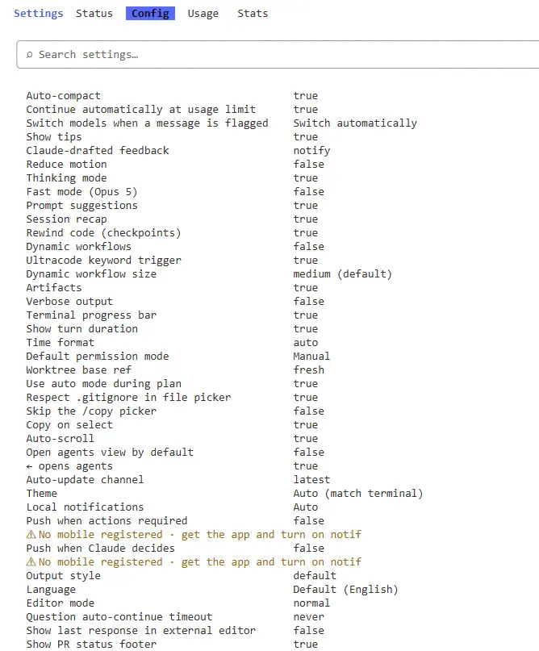


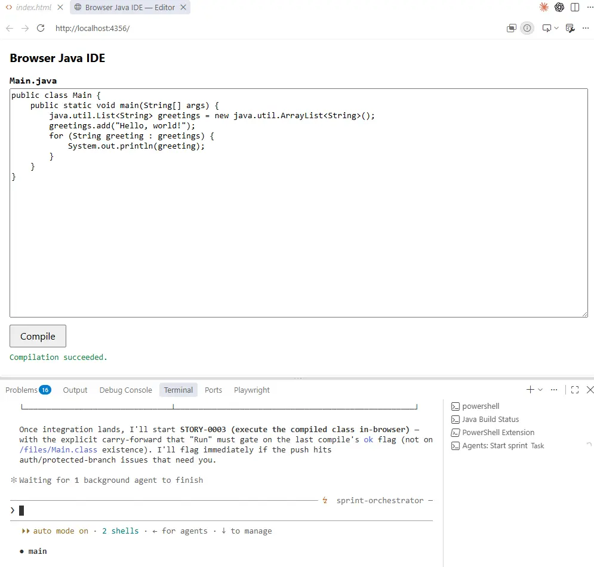

## Sprint 4/6 


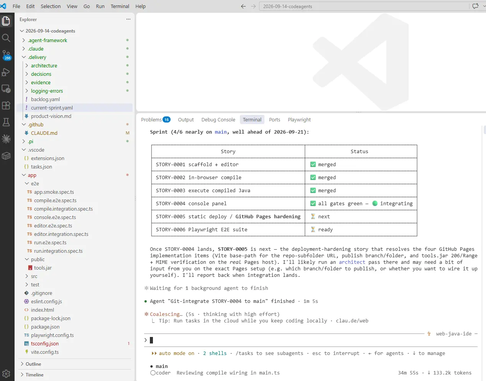

## usage 

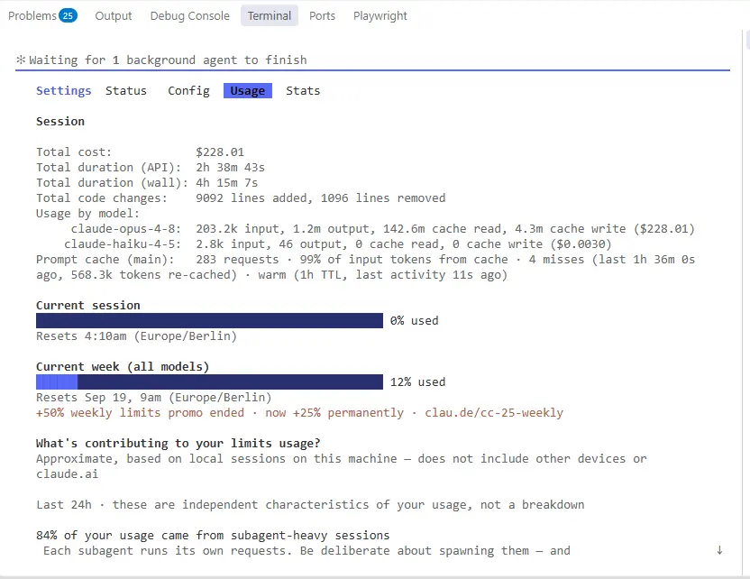


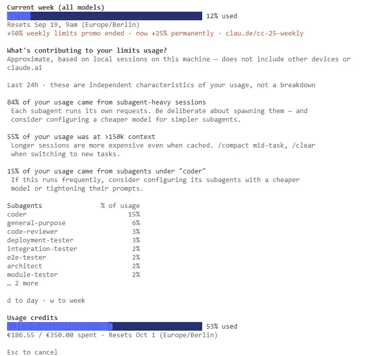
## Demo

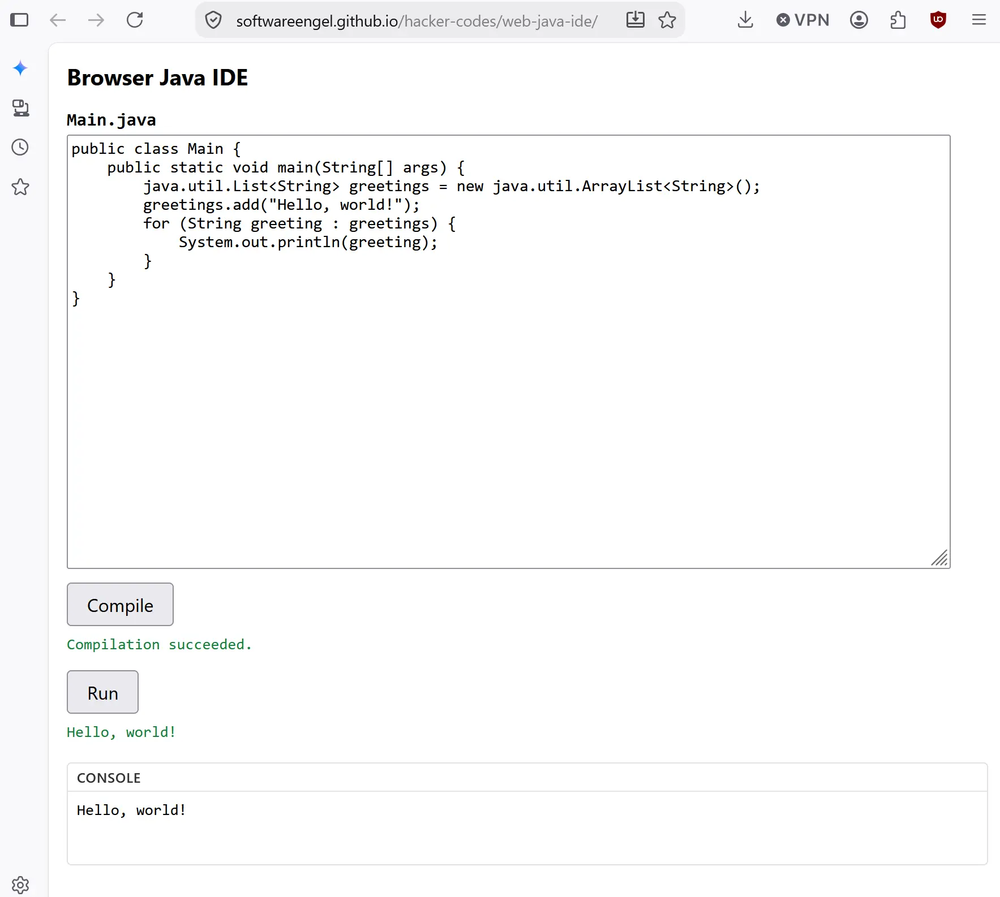


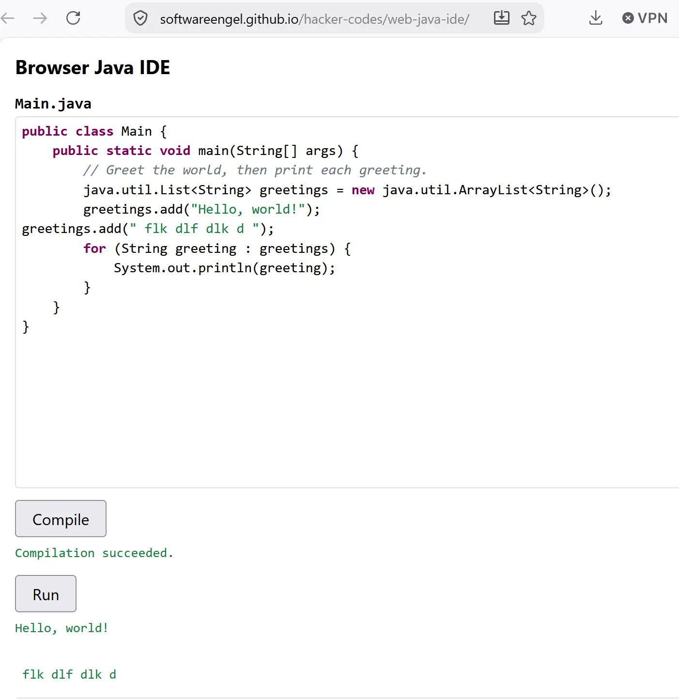


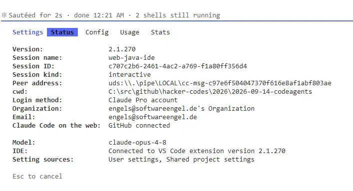


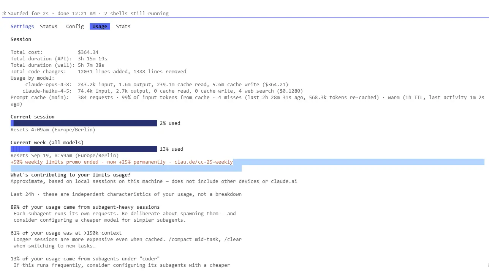
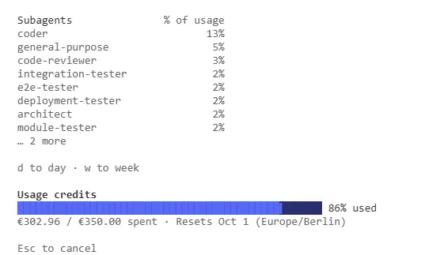


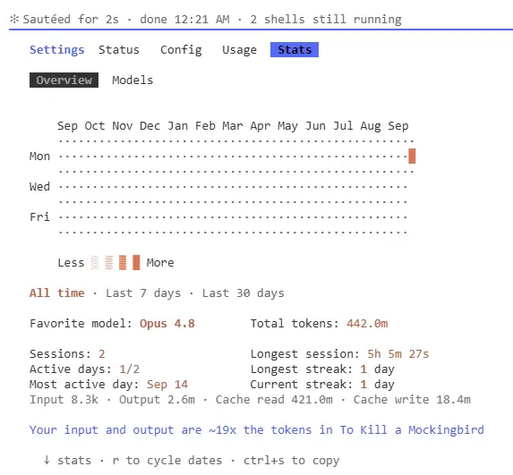


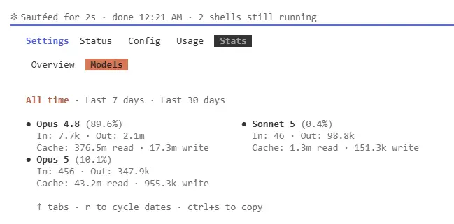
