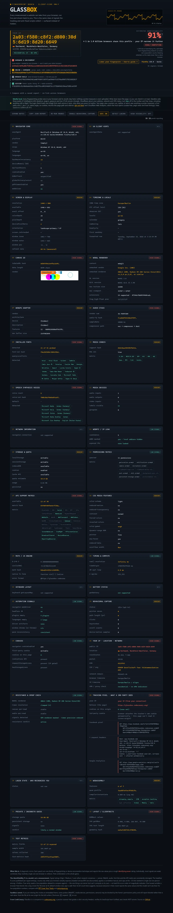

# glassbox

Every measurement a website can take from your browser, run live and shown back to you. This is the same class of signals the tracking and anti-fraud scripts collect — surfaced instead of hidden.

## Links

https://glassbox.codecanary.org/