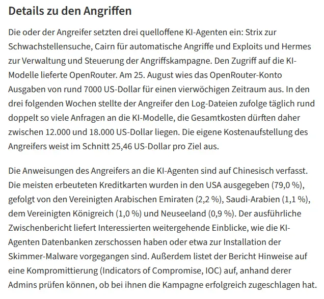

## Links

https://www.heise.de/news/Angriff-mit-KI-Agenten-auf-hunderte-Shops-600-000-Kreditkartendaten-geklaut-11464492.html

https://www.bleepingcomputer.com/news/security/malicious-ai-agents-steal-600k-credit-cards-infect-100-plus-sites-with-skimmers/

https://github.com/usestrix/strix

https://github.com/oritera/Cairn

https://www.viableedge.com/blog/hermes-agent-claude-code-orchestration
https://hermes-agent.nousresearch.com/
https://github.com/NousResearch/hermes-agent
