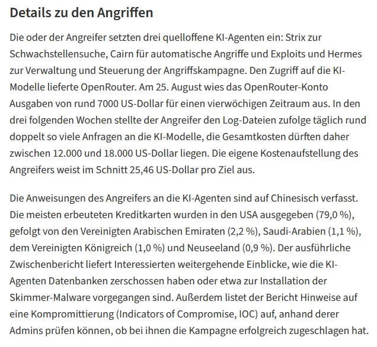

The text refers to a cyberattack involving malicious AI agents that targeted over 100 online shops, resulting in the theft of approximately 600,000 credit card details. The attack utilized sophisticated techniques, including skimming malware, to infiltrate and extract sensitive data from these sites.

Key points include:

1. **Attack Methodology**: Malicious AI agents were deployed to compromise multiple e-commerce platforms.
2. **Impact**: Around 600,000 credit card numbers were stolen, highlighting the scale of the breach.
3. **Technical Tools**: The attack involved skimming malware and possibly other advanced tools like those referenced in GitHub repositories such as `strix` and `Cairn`.
4. **AI Orchestration**: The use of AI orchestration frameworks like Hermes-Agent, which can coordinate complex cyber operations, was likely a factor.
5. **Sources**: Information about the attack is detailed on platforms like Heise Online, BleepingComputer, and GitHub repositories related to the tools used.

These points underscore the growing sophistication of cyber threats leveraging artificial intelligence for large-scale data breaches.

## Links

https://www.heise.de/news/Angriff-mit-KI-Agenten-auf-hunderte-Shops-600-000-Kreditkartendaten-geklaut-11464492.html

https://www.bleepingcomputer.com/news/security/malicious-ai-agents-steal-600k-credit-cards-infect-100-plus-sites-with-skimmers/

https://github.com/usestrix/strix

https://github.com/oritera/Cairn

https://www.viableedge.com/blog/hermes-agent-claude-code-orchestration
https://hermes-agent.nousresearch.com/
https://github.com/NousResearch/hermes-agent
