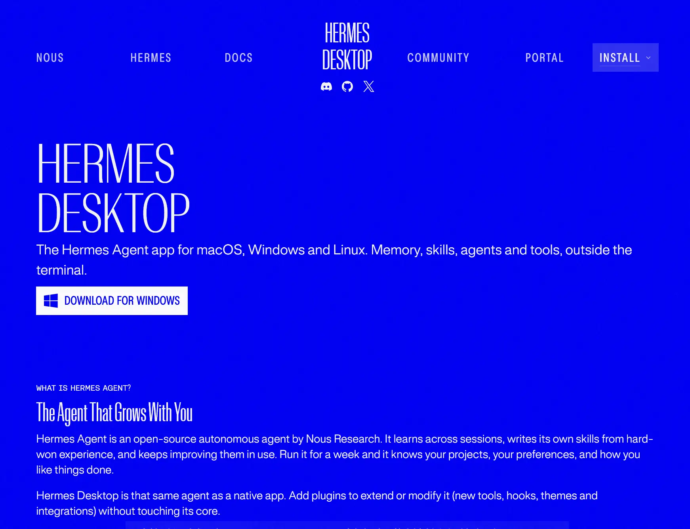

## The Agent That Grows With You
Hermes Agent is an open-source autonomous agent by Nous Research. It learns across sessions, writes its own skills from hard-won experience, and keeps improving them in use. Run it for a week and it knows your projects, your preferences, and how you like things done.

Hermes Desktop is that same agent as a native app. Add plugins to extend or modify it (new tools, hooks, themes and integrations) without touching its core.

https://hermes-agent.nousresearch.com/desktop

