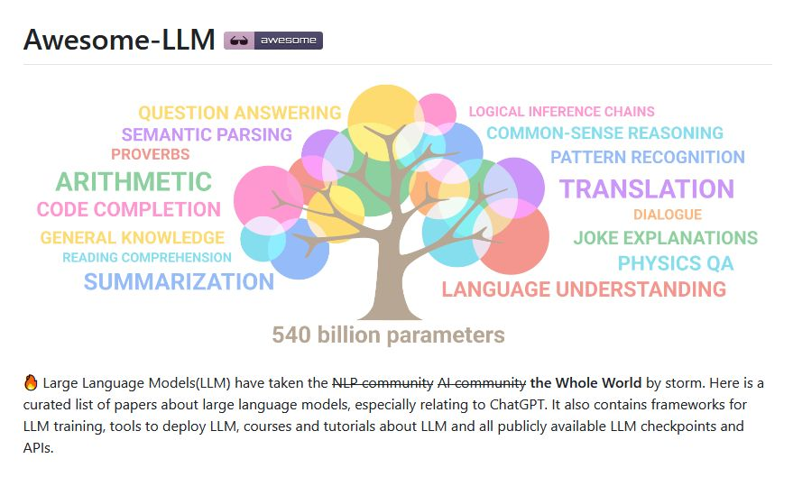

## https://github.com/Shubhamsaboo/awesome-llm-apps

## https://github.com/Hannibal046/Awesome-LLM

## Table of Content

- [Awesome-LLM](https://github.com/Hannibal046/Awesome-LLM?tab=readme-ov-file#awesome-llm-)
    - [Milestone Papers](https://github.com/Hannibal046/Awesome-LLM?tab=readme-ov-file#milestone-papers)
    - [Other Papers](https://github.com/Hannibal046/Awesome-LLM?tab=readme-ov-file#other-papers)
    - [LLM Leaderboard](https://github.com/Hannibal046/Awesome-LLM?tab=readme-ov-file#llm-leaderboard)
    - [Open LLM](https://github.com/Hannibal046/Awesome-LLM?tab=readme-ov-file#open-llm)
    - [LLM Data](https://github.com/Hannibal046/Awesome-LLM?tab=readme-ov-file#llm-data)
    - [LLM Evaluation](https://github.com/Hannibal046/Awesome-LLM?tab=readme-ov-file#llm-evaluation)
    - [LLM Training Framework](https://github.com/Hannibal046/Awesome-LLM?tab=readme-ov-file#llm-training-frameworks)
    - [LLM Inference](https://github.com/Hannibal046/Awesome-LLM?tab=readme-ov-file#llm-inference)
    - [LLM Applications](https://github.com/Hannibal046/Awesome-LLM?tab=readme-ov-file#llm-applications)
    - [LLM Tutorials and Courses](https://github.com/Hannibal046/Awesome-LLM?tab=readme-ov-file#llm-tutorials-and-courses)
    - [LLM Books](https://github.com/Hannibal046/Awesome-LLM?tab=readme-ov-file#llm-books)
    - [Great thoughts about LLM](https://github.com/Hannibal046/Awesome-LLM?tab=readme-ov-file#great-thoughts-about-llm)
    - [Miscellaneous](https://github.com/Hannibal046/Awesome-LLM?tab=readme-ov-file#miscellaneous)