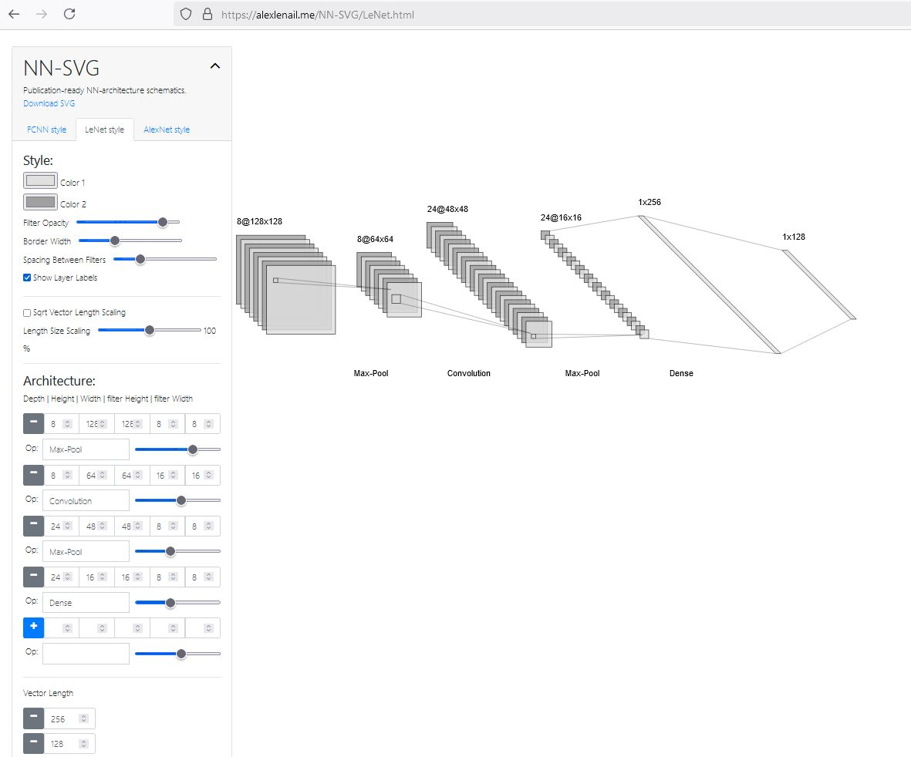

# Neural Network SVG 

Illustrations of Neural Network architectures are often time-consuming to produce, and machine learning researchers all too often find themselves constructing these diagrams from scratch by hand.

NN-SVG is a tool for creating Neural Network (NN) architecture drawings parametrically rather than manually. It also provides the ability to export those drawings to Scalable Vector Graphics (SVG) files, suitable for inclusion in academic papers or web pages.

The tool provides the ability to generate figures of three kinds: classic Fully-Connected Neural Network (FCNN) figures, Convolutional Neural Network (CNN) figures of the sort introduced in [the LeNet paper](http://yann.lecun.com/exdb/publis/pdf/lecun-01a.pdf), and Deep Neural Network figures following the style introduced in [the AlexNet paper](https://papers.nips.cc/paper/4824-imagenet-classification-with-deep-convolutional-neural-networks.pdf). The former two are accomplished using the [D3 javascript library](https://d3js.org/) and the latter with the javascript library [Three.js](https://threejs.org/). NN-SVG provides the ability to style the figure to the user's liking via many size, color, and layout parameters.

I hope this tool will save machine learning researchers time, and I hope this software might also serve as a pedagogical tool in some contexts.

## Links 

<https://alexlenail.me/NN-SVG/AlexNet.html>

<https://github.com/alexlenail/NN-SVG>
